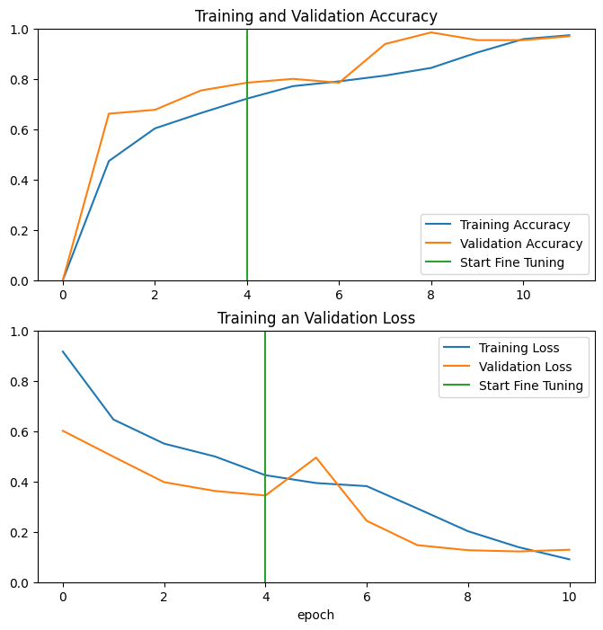

In this [experiment](G_Transfer_Learning_with_MobileNet.ipynb), I used a pre-trained convolutional neural network to classify images of alpaca/not alpaca, with the starting code, hints, dataset and utility functions from the [Convolutional Neural Networks](https://coursera.org/learn/convolutional-neural-networks) course (offered by DeepLearning.AI on Coursera).

There are two parts. In the first part, I only trained the new classification layer. I imported a pre-trained MobileNet model, without the top layer (the classification layer), then add a new classifier layer. Only the newly-created classification layer will be trained on the alpaca image dataset, while the base MobileNet model is frozen.

In the second part, I fine-tuned the model by unfreezing the last several layers of the neural network, and re-train these final layers with low learning rate.

The result shows that validation accuracy and loss continues to improve when we allow the last layers of MobileNet to be trained on our specific alpaca classification task:
